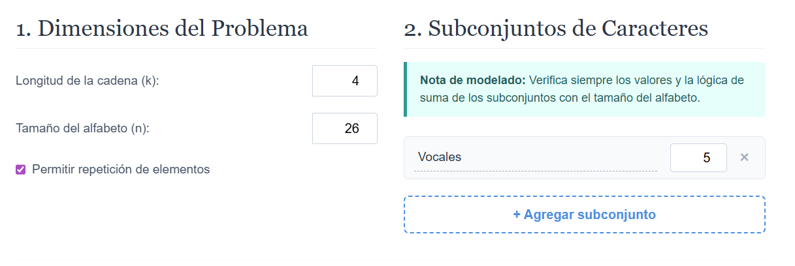
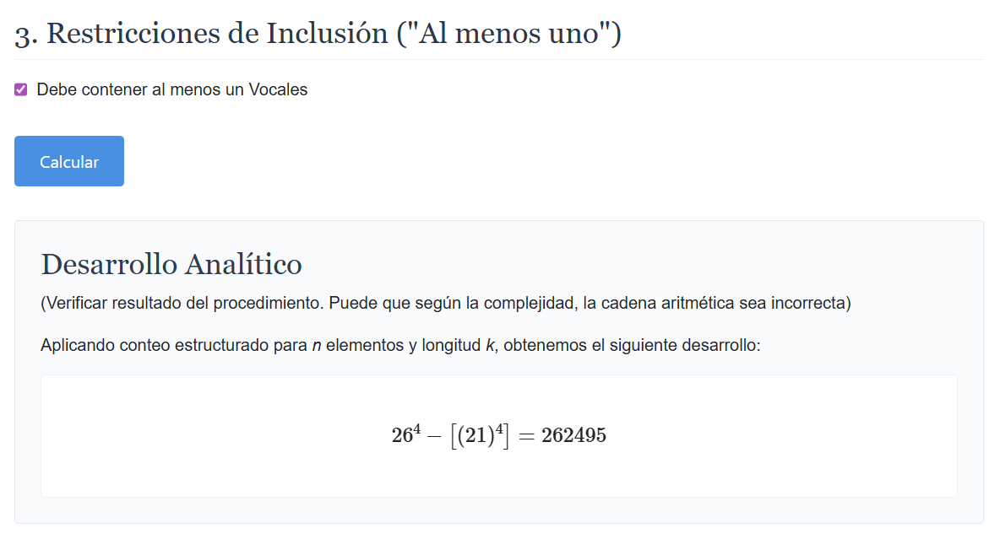
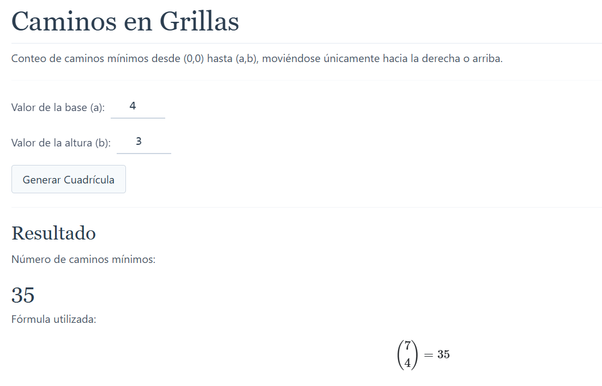
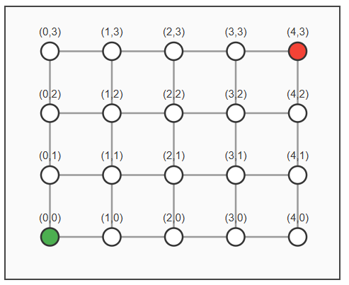

# Problemas de Conteo
Esta es una aplicación web diseñada para resolver problemas combinatorios: análisis de espacios de contraseña y conteo de caminos mínimos en grillas.

Conceptos implementados:
- Principios fundamentales de conteo.
- Permutaciones y variaciones.
- Combinaciones.
- Regla de producto.
- Principio de complementación.
- Principio de Inclusión-Exclusión.
- Restricciones de tipo "al menos uno".
- Caminos mínimos en grillas.
- Puntos obligatorios y puntos de bloqueados.

## Tecnologías Utilizadas
- **Blazor (.NET 8)** - Arquitectura de componentes SPA en WebAssembly/Server.
- **C#** - Lógica analítica respaldada por `BigInteger` para precisión matemática infinita.
- **MathJax** - Renderizado dinámico de formulas LaTex.

## Requisitos
- .NET SDK 8.0 o superior instalado en el sistema. Puede descargarlo [acá](https://dotnet.microsoft.com/en-us/download/visual-studio-sdks)

## Instalación

Para ejecutar este proyecto, clone el repositorio:
```bash
git clone https://github.com/DioRB/ProblemasDeConteo.git
```

Ingresa a la carpeta raiz del proyecto
```bash
cd ProblemasDeConteo
```

Restaura 
```bash
dotnet restore
```

Ejecuta

```bash
dotnet run
```

Abra en un navegador la URL dada por la aplicación (normalmente https://localhost:xxxx).

Navegue y seleccione el módulo deseado, los cuales son Contador de contraseñas y Caminos en grilla

(Imagen)

## Instrucciones de uso: Conteo de contraseñas.
1. Ingrese la longitud de la contraseña.
2. Ingrese el tamaño total del alfabeto.
3. Defina los grupos de caracteres.
4. Marque los grupos requeridos.
5. Presione Calcular.




El resultado muestra la operación aritmetica utilizada y su resultado numérico.

## Instrucciones de uso: Caminos minimos en grilla.
1. Ingrese los valores de base (a) y de altura (b), punto donde se encuentra el destino de la grilla.
2. Presione "Generar Cuadrícula"
3. Visualice los resultados en el caso base (sin puntos obligatorios ni bloqueados) y la respectiva grilla.
4. Seleccione entre Modo Bloqueo y Modo Obligatorio, y coloque puntos a su gusto en la grilla.
5. Abajo observará las explicaciones en las secciones correspondientes de Caminos Obligatorios y Caminos Bloqueados.
6. Experimente distintos tamaños y configuraciones para analizar cómo cambian los resultados.





El resultado muestra el desarrollo matemático utilizado para calcular la cantidad total de caminos, incluyendo los aportes de los puntos obligatorios y las restricciones impuestas por los puntos bloqueados.

Puede encontrar información un poco más especifica en el documento presente en el repositorio [ProblemasConteo.pdf](https://github.com/DioRB/ProblemasDeConteo/blob/main/ProblemasConteo.pdf)


